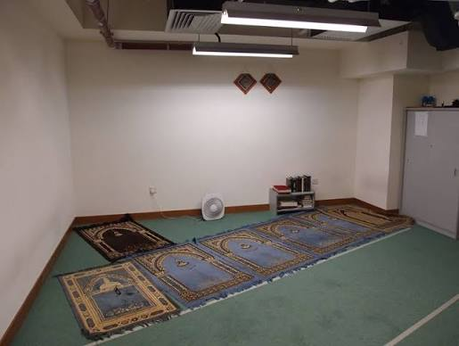
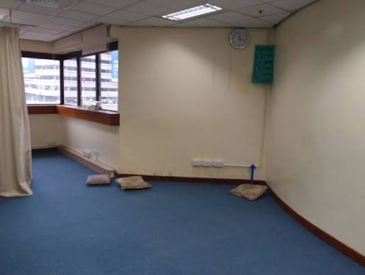
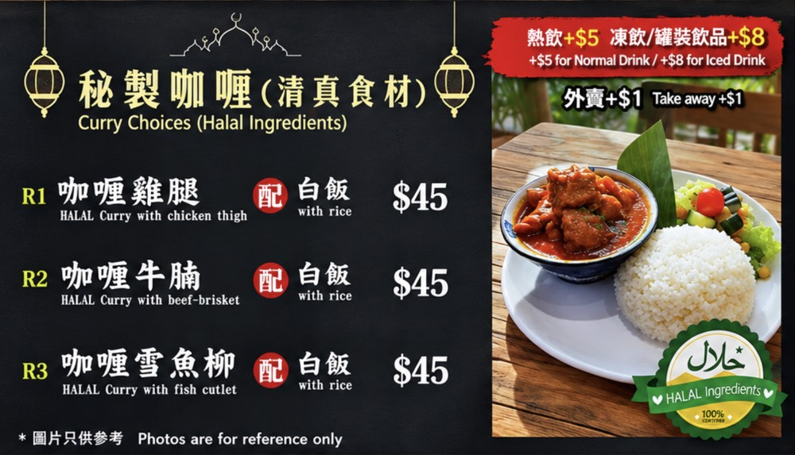
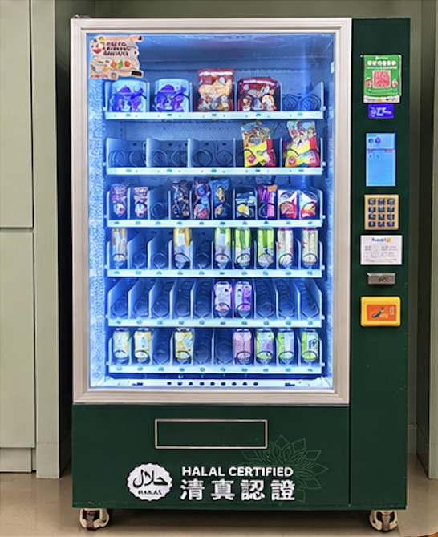
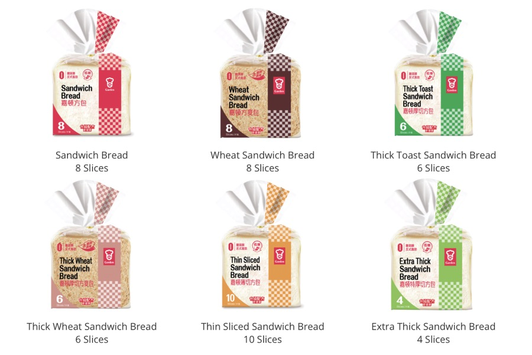
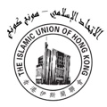

# The Muslim Guide to PolyU — snapshot

Everything the guide showed on 2026-09-23, at commit `5f286ec`. Generated from `content.md` by `npm run snapshot`: edit the guide there, not here.

MUSA — PolyU Muslim Association · version 1.0

## What is in the guide

| Section | Listings |
| --- | --- |
| Prayer Facilities | 6 |
| Muslim-Friendly Washrooms | 2 |
| Halal Food & Groceries | 20 |

## Prayer Facilities

### Prayer Rooms on Campus

#### Z302a

Prayers: Dhuhr · Asr · Maghrib · Isha · Jummah held here

Access: Student card entry

Layout: Men's & women's areas

[Live prayer times](https://mosque-prayer-display-screen-cyan.vercel.app)

#### PQ502a

Prayers: Dhuhr · Asr · Maghrib · Isha · No Jummah

Access: Student card entry

Layout: Men's & women's areas

### Hall Prayer Rooms

#### Hung Hom Halls

2/F, beside the piano room

Access: Residents only

#### Homantin Halls

1/F, beside the gym

Access: Residents only

### Nearest Masjid

#### Discover Islam Hong Kong

Hung Hom

Prayers: Fajr · Dhuhr · Asr · Maghrib · Isha · Jummah held here

[Open in Google Maps](https://maps.app.goo.gl/fpzSoC8n3iSdeTu69)

### Prayer Times for HK Mosques

#### Athan Plus

[Open in Google Play](https://play.google.com/store/apps/details?id=com.masjidal.athanplus)

## Muslim-Friendly Washrooms

### Core C

| Floor | Washrooms |
| --- | --- |
| G | Female, Accessible |
| 1 | Male |
| P | Male, Female |
| 3 | Male, Female |
| 4 | Male, Female |
| 5 | Male |
| 6 | Male, Female |
| 7 | Male, Female |

### Core E

| Floor | Washrooms |
| --- | --- |
| G | Male |
| 1 | Female |
| P | Male |
| 3 | Male |
| 4 | Female, Accessible |
| 5 | Male |
| 6 | Female |
| 7 | Female |

## Halal Food & Groceries

### Campus

#### Halal by The Forest — Certified

Z Cafe, Z Core

[Visit the website](https://www.polyu.edu.hk/cfso/campus-environment-and-facilities/catering-facilities/catering-outlets/z-cafe/)

#### The Forest — VA Student Canteen — Section only

G/F, VA Student Canteen

**Warning: Only these 3 meals are halal. Other dishes are not.**

[Visit the website](https://www.polyu.edu.hk/cfso/campus-environment-and-facilities/catering-facilities/catering-outlets/va-student-canteen/)

#### Campus vending machine — Certified

VA210

#### Pacific Coffee — Check packaging

X Cafe, X Core

[Visit the website](https://www.polyu.edu.hk/cfso/campus-environment-and-facilities/catering-facilities/catering-outlets/x-cafe/)

#### 7-Eleven — Check packaging

P/F, VA

[Visit the website](https://www.polyu.edu.hk/fo/visitors/campus-wide-facilities/)

### Halls

#### Hung Hom Halls Canteen — Section only

Hung Hom Halls

**Warning: Only these 3 meals are halal. Other dishes are not.**

[Visit the website](https://www.polyu.edu.hk/cfso/campus-environment-and-facilities/catering-facilities/catering-outlets/hhsh-canteen/)

#### Homantin Halls vending machine — Check packaging

Homantin Halls, G/F canteen · Frozen halal meals

**Warning: The Homantin canteen itself has no halal food.**

### Halal Home Kitchens

> Community-known halal kitchens, but not endorsed by MUSA.

#### Halal Food Delivery Hong Kong — Community-known

≈HK$40 a meal · South Asian meals

[Join the WhatsApp group](https://chat.whatsapp.com/FbKoipG7m17GC9HOghzt2C)

#### Bangladeshi Halal Food — Community-known

≈HK$40 a meal · South Asian meals

[Join the WhatsApp group](https://chat.whatsapp.com/LcFJXcxJQ3jE4zf7vVgqMd)

#### Pakistani Halal Food — Community-known

≈HK$40 a meal · South Asian meals

[Join the WhatsApp group](https://chat.whatsapp.com/LWmReNeQYwHFVJJMLz2yZ9)

### Supermarkets

#### ParknShop (near campus) — Check packaging

[Open in Google Maps](https://maps.app.goo.gl/yF8Y3U2ATM7XPgvEA)

#### ParknShop (near Homantin Halls) — Check packaging

[Open in Google Maps](https://maps.app.goo.gl/XvX6UypsnyTqaWLs9)

#### ParknShop (near Hung Hom Halls) — Check packaging

[Open in Google Maps](https://maps.app.goo.gl/VP4dTyGSyXyiVi7v9)

#### Taste — Check packaging

[Open in Google Maps](https://maps.app.goo.gl/J1KLcg6d8qdzFrtB6?g_st=aw)

#### Wellcome — Check packaging

[Open in Google Maps](https://www.google.com/maps/place/Wellcome/@22.3057914,114.1865303,17z/data=!3m1!4b1!4m6!3m5!1s0x340400e0a8c5c933:0x60a6e0d5b33f4b73!8m2!3d22.3057914!4d114.1865303!16s%2Fg%2F1tlnb0nt!18m1!1e1?entry=ttu&g_ep=EgoyMDI2MDkxNC4wIKXMDSoASAFQAw%3D%3D)

#### DS Groceries — Check packaging

[Open in Google Maps](https://maps.app.goo.gl/KyaoL41JAT5GJazu7)

#### Ka Hing Supermarket — Check packaging

[Open in Google Maps](https://maps.app.goo.gl/ZbyruHjwpNYpqduW7)

#### Halal bread

Only these 6 Garden sandwich breads are halal certified. Giant Sandwich Bread is not. Sold at 7-Eleven, Circle K, ParknShop, Wellcome.

[Visit the website](https://www.garden.com.hk/en/product/hong-kong/retail/bread/sandwich-bread/)

### Grocery Delivery

#### Waqas Store — Community-known

Free delivery to both halls

[Join the WhatsApp group](https://chat.whatsapp.com/Bkfea00tZUdBsbP7dyuhM9)

### More in Hong Kong

#### Hong Kong Halal Food List (IUHK)

Full Hong Kong halal list by IUHK. Check its date first.

[Open the PDF](https://www.iuhk.org/images/Others/Halah-Food/Halal-List_en.pdf)

## Known gaps

Reported by `npm run check`.

- site: live URL once hosting is decided
- contact: MUSA email
- instagram: MUSA Instagram handle
- whatsapp: MUSA WhatsApp or join link
- Discover Islam Hong Kong: exact street address, confirmed Jummah time, whether students are welcome
- Athan Plus: iOS App Store link
- Campus vending machine: official name of this vending machine
- Pacific Coffee: confirm Pacific Coffee is the X Cafe outlet
- 7-Eleven: list the specific certified instant noodles, juices and snacks if anyone verifies them
- Halal Food Delivery Hong Kong: delivery area
- Bangladeshi Halal Food: delivery area
- Pakistani Halal Food: delivery area
